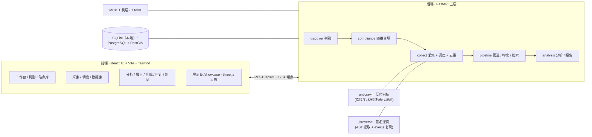

# WebInsight · 智能数据分析平台

> 任意站点，从可采判定到洞察报告 —— 通用型网站分析 / 数据采集 / 数据挖掘 / 数据分析平台。


*演示路线：展示岛星云 → 工作台 → 站点判别 → 采集 → 数据集 → 合规矩阵（`.\scripts\demo.ps1` 一键复现）*

---

## ✨ 这是什么

WebInsight 把「站点判别 → 合规判定 → 采集 → 管道物化 → 分析 → 报告 → 审计」串成一条**可复现的产品主链**：

- **任意 URL 先过四维合规判定**（可访问性 / 授权基础 / 行为合规 / 数据属性）——判定落成代码，每一次放行与阻断可回溯到证据；
- **采集层内置反爬对抗矩阵**：自适应策略链（httpx → `curl_cffi` 浏览器 TLS 指纹 → Scrapling → StealthyFetcher）、进程级共享限速、三级去重、断点续传、定时调度、**Cloudflare 挑战自动升级链**（实测 8.5s 通过）；
- **验证码自动化链**：图片（ddddocr 本地 OCR）· 滑块（OpenCV 缺口检测 + 拟人轨迹拖拽）· 行为验证码（reCAPTCHA 端到端通过）；
- **数据资产**：物化为可检索（多关键字 AND / 时间过滤）、可对比、可版本追踪的数据集；
- **治理闭环**：合规中心（A×B 语义热力矩阵 + 证据留痕）· 五类动作审计 · 保留报告 · Prometheus 指标；
- **Agent 原生**：MCP 工具面（7 工具）——「分析 → 采集 → 分析 → 报告」闭环可审计。

## 🏗 架构总览



## 🧭 功能全景

| 模块 | 能力 |
|---|---|
| **判别层** | SiteProfile 站点画像 · 能力注册表 · 四维合规判定（判定落代码，授权补齐写审计） |
| **采集层** | 自适应策略链 · 浏览器化 TLS 指纹（curl_cffi）· Cloudflare 挑战升级链（StealthyFetcher）· 共享限速器 · 三级去重 · 分页 · 断点续传 · 定时调度 · 代理池（轮换 + 失败剔除）|
| **反爬对抗** | 图片验证码（ddddocr 本地 → CapSolver 兜底）· 滑块（缺口检测 + 拟人轨迹）· 行为验证码（reCAPTCHA / hCaptcha / Turnstile，CapSolver 协议 + 页面注入）· 挑战检测自动升级 |
| **签名逆向** | JS 逆向引擎（AST 函数发现 / 括号平衡提取 / execjs 复现）· B 站 wbi 签名（公开算法，服务端认可）· 签名实验室（仿真站全链） |
| **登录态** | 表单自动探测（password 锚点 + 近邻推断）· 自动登录 + 失败检测 · Cookie 加密存储与复用 |
| **API 解析** | 网络嗅探（XHR/JSON 接口自动发现）· **API 直连取数**（免渲染）· 公开 API 生态接入 |
| **管道层** | 字段规范化 · PII 策略 · 字段级血缘 · 数据集版本链 · 多关键字检索 / 时间过滤 / 差异对比 |
| **分析层** | EDA · 描述统计 · 相关性 · 图表（echarts 按需加载）· 报告生成 |
| **治理层** | 合规中心（A×B 语义热力矩阵）· 审计（5 类动作留痕 + JSON 证据块）· 运行监视（限速/sparkline）· 保留报告 · Prometheus 指标 |
| **前端** | 16 路由 · v5 亮青控制台设计系统 · 动效三层（Reveal/Tilt/CountUp → 扫描光/图表编排 → three.js 星云）· reduced-motion 守护 · 移动端适配 |
| **Agent** | MCP 工具面 7 工具 · 接入管理面 · 调用审计 |

## 🛠 技术栈

| 层 | 选型 |
|---|---|
| 后端 | FastAPI · SQLAlchemy · Pydantic · Celery / Redis（可选）· SQLite（本地）/ PostgreSQL + PostGIS |
| 采集对抗 | httpx · curl_cffi · Scrapling（StealthyFetcher + patchright）· Playwright · ddddocr · OpenCV · CapSolver 协议 · 自研 anticrawl（指纹/验证码/代理池） |
| 逆向 | esprima（AST）· PyExecJS（Node 运行时）· 自研 js_reverse_engine |
| 数据 | pandas · NumPy · scikit-learn · matplotlib（报告） |
| 前端 | React 18 · TypeScript · Vite · Tailwind · shadcn/ui 模式 · motion · echarts（懒加载）· three.js（懒加载） |
| 质量 | pytest（231 passed）· 实机门禁脚本矩阵（Playwright · 截图 + result.txt 证据）· 性能预算守护 |

## 🚀 快速开始

```powershell
# 后端（首次）
cd backend
python -m venv venv
.\venv\Scripts\python.exe -m pip install -r requirements-v2.txt
Copy-Item .env.example .env -ErrorAction SilentlyContinue

# 前端（首次）
cd ..\frontend
npm install

# 日常开发（检查 / 启动 / 状态 / 停止）
cd ..
.\run-dev.cmd check
.\run-dev.cmd start

# 90 秒演示（一键起全栈 + 打开展示岛）
.\scripts\demo.ps1
```

默认地址：前端 `http://127.0.0.1:5173` · 后端 `http://127.0.0.1:8000` · Swagger `/docs` · 能力状态 `/capabilities`

## 📁 项目结构

```text
backend/
  api/            FastAPI 入口 / 路由 / 模型（auth · crawl · analysis · data · reports · smoke · audit · monitor · mcp …）
  crawlers/       采集内核（adapters · intelligent · anticrawl · auth · jsreverse · custom · finance/news/ecommerce/energy …）
  pipeline/       数据管道（物化 / 检索 / 血缘 / 版本）
  analysis/       EDA / 统计 / 图表 / 报告引擎
  compliance/     四维合规引擎
  discover/       站点判别内核
  mcp/            MCP 工具服务端（7 工具 + 审计）
  smoke/          验收编排（scenarios / contracts / assisted auth）
  scripts/        实机门禁脚本矩阵（verify_*.py）+ 演示资产采集
  tests/          pytest 套件（unit / integration · 隔离库）
frontend/
  src/pages/      16 路由页面（工作台 / 判别 / 采集 / 数据集 / 合规 / 审计 / 监视 / 展示岛 …）
  src/components/ layout · motion（Reveal/Tilt/CountUp）· visual（MiniCharts/console/星云）· ui（shadcn 模式）
  src/api/        模块化 API 封装
openspec/         OpenSpec 工作流与规范
docs/             规格 · 蓝图 · 施工记录 · 验收证据（evidence/ 截图 + result.txt）
design/           设计参考图（v3/v4/v5 生图工作流产物）
scripts/          run-dev / demo 一键脚本
```

## ✅ 测试与验收

- **231 项测试全绿**（隔离测试库；主库哨兵防脏写）
- **实机门禁矩阵**（`backend/scripts/verify_*.py`，全部产出截图 + `result.txt` 证据）：

| 门禁 | 覆盖 |
|---|---|
| `verify_ui_v3.py` | 16 路由渲染 + 零 console 错误 + 全页截图 |
| `verify_perf_budget.py` | 首屏预算 ≤300KB gzip + 懒加载链验证 |
| `verify_mobile_375.py` | 移动端零横向溢出 + reduced-motion |
| `verify_collect_ladder.py` | 采集阶梯 L0-L6（静态 → CF 挑战 → 逆向） |
| `verify_captcha_v4.py` | 行为验证码三链（reCAPTCHA/hCaptcha/Turnstile） |
| `verify_real_targets.py` | 真实站四方向（公开 API / 金融数据 / XHR 嗅探 / CF） |
| `verify_global_sources.py` | 全球三梯队（公开 API → 靶场 → 反爬观察） |
| `verify_jsreverse_lab.py` | 签名实验室（提取 → 复现 → 防重放对照） |
| `verify_robots_compliance.py` | robots 合规判定（不可采目标零请求纪律） |

- 证据归档：`docs/evidence/`（每个阶段一组截图 + 结果文本）

## 🎨 设计系统（v5 亮青控制台）

- 主色 `#31d4ed` 亮青 · 深蓝黑表面分级 · hairline 描边 · 卡片顶部微光
- 组件语言：实底状态 pill · 环形进度（RingProgress）· 迷你曲线（Sparkline）· 证据代码块（code-block）
- 动效三层：L1（页面转场 / Reveal / Tilt / CountUp）· L2（扫描光 / 图表编排）· L3（three.js 星云）
- 数据真实性纪律：所有图表、读数、环形均来自真实接口——**不造假曲线**

## 📚 文档索引

| 文档 | 内容 |
|---|---|
| [`AGENTS.md`](AGENTS.md) | 项目接手手册（架构 / 约定 / 命令 / 风险） |
| [`docs/REBUILD-SPEC-v3.md`](docs/REBUILD-SPEC-v3.md) | 重建规格（canonical 基线） |
| [`docs/UPGRADE-PLAN-v5.md`](docs/UPGRADE-PLAN-v5.md) | v5 升级蓝图（P7–P12） |
| [`docs/REBUILD-PROGRESS.md`](docs/REBUILD-PROGRESS.md) | 逐阶段施工记录（含验收证据） |
| [`docs/COLLECT-CAPABILITY-MATRIX.md`](docs/COLLECT-CAPABILITY-MATRIX.md) | 采集能力阶梯 + 验证码链矩阵 |
| [`docs/DEPENDENCY-BUDGET.md`](docs/DEPENDENCY-BUDGET.md) | 依赖与体积预算表 |
| [`AUTH-ANTICRAWL-GUIDE.md`](AUTH-ANTICRAWL-GUIDE.md) | 登录态与反爬指南 |

---

*历史版本：[`README-v2.md`](README-v2.md)（v2 时代留存）。*
