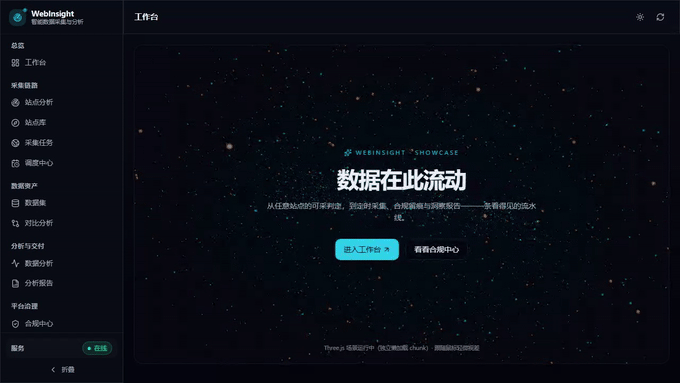
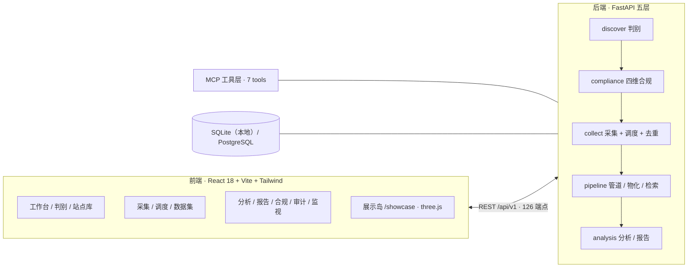

# WebInsight · 智能数据分析平台

> 任意站点，从可采判定到洞察报告。




*演示：展示岛星云 → 工作台 → 站点判别 → 采集 → 数据集 → 合规矩阵（`.\scripts\demo.ps1` 一键复现）*

---

WebInsight 把「站点判别 → 合规判定 → 采集 → 管道物化 → 分析 → 报告 → 审计」串成一条**可复现的产品主链**：

- 任意 URL 先过**四维合规判定**（可访问性 / 授权基础 / 行为合规 / 数据属性）——判定落成代码，每一次放行与阻断可回溯到证据；
- 采集走自适应策略链（httpx → Scrapling → Playwright）、进程级共享限速、**三级去重**，支持断点续传与定时调度；
- 数据物化为**可检索、可对比、可版本追踪**的数据集（多关键字检索 / 时间过滤 / 版本链 / 差异对比）；
- 全链每一步都能沿「数据 → 血缘 → 规则 → 画像 → 判定 → 审计」一路回溯。

## 架构



## 核心能力

| 层 | 能力 | 亮点 |
|---|---|---|
| 判别 | SiteProfile + 能力注册表 | 四维合规判定（判定落代码，授权补齐写审计） |
| 采集 | 自适应策略链 + 共享限速 + 三级去重 | 断点续传重入、定时调度、robots 门禁、合规强制点 |
| 管道 | 字段规范化 + PII + 血缘 | 数据集版本链、多关键字检索、时间过滤、差异对比 |
| 分析 | EDA / 统计 / 图表 / 报告 | 每个字段可回溯到提取规则与来源页面 |
| 治理 | 合规中心 / 审计 / 监视 | A×B 判定矩阵、5 类动作审计留痕、保留报告、Prometheus 指标 |
| Agent | MCP 工具面 | 「分析 → 采集 → 分析 → 报告」闭环可审计 |

## 90 秒演示

```powershell
.\scripts\demo.ps1        # 启动全栈（后端 :8000 + 前端 :5173）并打开展示岛
.\scripts\demo.ps1 -Stop  # 停止
```

**演示路线（S1 → S3）**

1. **S1** `/showcase` —— 数据星云（three.js 独立懒加载）
2. **S2** `/discover` —— 输入 URL → 四维判定逐维点亮
3. **S2** `/collect` —— 创建采集 → 管道流动 → 物化数据集
4. **S2** `/datasets/2` —— 检索（多词 AND / 时间过滤）→ 版本历史 → 对比
5. **S3** `/compliance` —— A×B 矩阵 → 点开红点展开四维取证

## 快速开始（本地开发）

```powershell
# 后端（首次）
cd backend
python -m venv venv
.\venv\Scripts\python.exe -m pip install -r requirements-v2.txt
Copy-Item .env.example .env -ErrorAction SilentlyContinue

# 前端（首次）
cd ..\frontend
npm install

# 日常开发（检查 / 启动 / 状态 / 停止）
cd ..
.\run-dev.cmd check
.\run-dev.cmd start
```

默认地址：前端 `http://127.0.0.1:5173` · 后端 `http://127.0.0.1:8000` · Swagger `/docs` · 能力状态 `/capabilities`

## 验证现状

- **178 测试全绿**（隔离测试库；主库哨兵防止测试写脏数据）
- **实机门禁证据**：`docs/evidence/`（各阶段截图 + `result.txt`，含「导出触发 → 审计落库」类端到端断言）
- 首屏预算 **228.7KB gzip**（入口四件套合计；上限 300KB，`verify_perf_budget.py` 守护）；echarts / three.js 均为按需加载
- 可观测：`GET /api/v1/monitor/metrics`（Prometheus 文本格式）、`/monitor` 保留报告

## 文档索引

| 文档 | 内容 |
|---|---|
| [`AGENTS.md`](AGENTS.md) | 项目接手手册（架构 / 约定 / 命令 / 风险） |
| [`docs/REBUILD-SPEC-v3.md`](docs/REBUILD-SPEC-v3.md) | 重建规格（canonical 基线） |
| [`docs/UPGRADE-PLAN-v5.md`](docs/UPGRADE-PLAN-v5.md) | v5 升级蓝图（P7–P12） |
| [`docs/REBUILD-PROGRESS.md`](docs/REBUILD-PROGRESS.md) | 逐阶段施工记录（含验收证据） |
| [`docs/HERMES-PROMPT-v3.md`](docs/HERMES-PROMPT-v3.md) | 双形态部署说明（Full / Lite） |
| [`docs/DATA_SOURCE_MAP.md`](docs/DATA_SOURCE_MAP.md) | 数据源全景与反爬能力评估 |

---

*v2 时代的 README 见 [`README-v2.md`](README-v2.md)（历史留存，勿作为当前入口）。*
