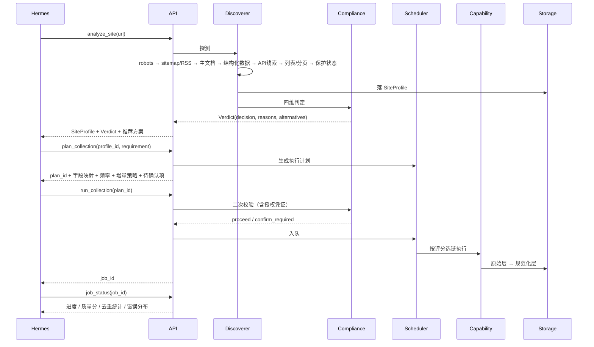

# 智能数据平台 · 第三代重建规格书

> 用途：本项目下一阶段的唯一施工依据。写给 Hermes（实施方）与 YG（验收方）。
> 与现有文档的关系：本文件取代 `PROJECT_OPTIMIZATION_PLAN.md` 与 `DESIGN-v2-Enterprise.md`；
> `README-v2.md`、`AGENTS.md` 保留但需在 P0 阶段按本文件更新。
> 版本：v3.0 · 起草基线 2026-09-10 工作区快照

---

## 0. 本文件怎么用

**Hermes 先读顺序**：第 1 章（了解为什么重建）→ 第 2 章（知道要做到什么程度）→ 第 3~6 章（理解设计约束）→ 第 7 章（拿工单开工）。

**关键规则**：

1. 第 7 章的 P0 是硬前提。不完成 P0 不许进入 P1。原因见 7.0。
2. 第 4 章的六个设计决策是已定决策，实施时可以调整实现细节，不要推翻决策本身。要推翻先回到 YG 确认。
3. 第 9 章的红线是硬边界，不通过任何配置开关暴露。
4. 每完成一个阶段，在 `docs/REBUILD-PROGRESS.md` 追加一条记录：阶段号 / 完成项 / 验收命令 / 实测输出 / 遗留问题。

---

## 1. 现状诊断

### 1.1 结论：不是失败品，是未收敛

仓库里的零件完整度远高于「残缺品」的描述：

- 后端路由 11 个模块：`auth / crawl / analysis / data / reports / smoke / ml / dl / mining / health / local_data`
- 采集子系统 8 个：`adapter_framework`、`adapters/`、`anticrawl/`、`auth/`、`custom/`、`intelligent/`、`jsreverse/`、`utils/`
- 智能爬虫 v2 已具备 `AdaptiveScraper` + `intent_engine` + `quality_assessor` + `metrics` + `observ_logger` + `strategies/`
- 分析链路已具备 `analysis / ml / dl / mining / reports`
- 验收链路已有 `smoke/`（场景注册表 + 契约 + 人机协同）

这些东西的真实问题不是「没写」，而是**同一个能力有多种写法、新旧两套并存、没有统一契约**。所以每次要用的时候都得先判断「这次该调哪个」，判断成本高于实现成本，最终表现为「跑不起来」。

### 1.2 结构性问题清单

**问题 A · 入口分裂（最致命）**

| 旧 | 新 | 状态 |
|---|---|---|
| `backend/api/main-v2.py` | `backend/api/main.py` | 两套都在 |
| `backend/run_api.py` | `backend/api/main.py` | 两套都在 |
| `backend/run_api_simple.py` | — | 第三套 |
| `frontend/src/App-v2.tsx` | `frontend/src/App.tsx` | 两套都在 |
| `frontend/package-v2.json` | `frontend/package.json` | 两套都在 |
| `docker-compose.yml` | `docker-compose-v2.yml` | 两套都在 |
| `frontend/postcss.config.js` | `frontend/postcss.config.cjs` | 两套都在 |
| `frontend/tailwind.config.js` | `frontend/tailwind.config.cjs` | 两套都在 |

新接手者打开项目，第一件事是猜「哪套是真的在跑」。这个成本会无限重复。

**问题 A2 · 同名模块与包并存（Python 导入歧义，最严重）**

实测确认存在：

| 同名对 | 类型 |
|---|---|
| `backend/api/models.py` | 模块 |
| `backend/api/models/` | 包 |
| `backend/api/schemas.py` | 模块 |
| `backend/api/schemas/` | 包 |
| `backend/api/database.py` | 模块 |
| `backend/api/core/database.py` | 模块 |

`import api.models` 到底解析到哪一个，取决于文件系统顺序与导入时机。这是**静默 bug 源**：代码可能长期跑在错误的分支上而不报错，或者在某台机器上换一个解析顺序就突然行为不同。

这个问题优先级高于其余所有问题，P0 第一件事就是消除它。

另注：`backend/api/services/` 是空目录 —— 说明「业务逻辑沉到 service 层」的规划从未落地，逻辑目前堆在 routers 里。

**问题 B · 测试污染生产目录**

`backend/` 根目录下躺着 40+ 个 `test_*.py`，外加 `check_crawl.py`、`check_db.py`、`cleanup_db.py`、`populate_db.py`、`debug`、`debug2`、`crawl_jd_human.py`、`run_test.py`。

后果：目录不可读、pytest 收集到探索脚本报错、新人无法判断哪些测试是契约哪些是一次性验证。

**问题 C · 能力重复实现**

- 反爬三份：`crawlers/anticrawl/anticrawl_engine.py`、`crawlers/utils/anti_crawler.py`、`crawlers/test_anti_crawler.py`
- 解析两份以上：`crawlers/utils/parser.py`、`crawlers/smart_extractor.py`、`crawlers/ranking_extractor.py`
- 存储三份：`crawlers/utils/storage.py`、`crawlers/dataset_service.py`、`crawlers/data_importer.py`
- 分页两份：`crawlers/pagination.py`、`crawlers/intelligent/` 内逻辑
- 采集入口两份：`crawlers/url_crawler.py`、`crawlers/intelligent/adaptive_scraper.py`

同一个问题有两到三个答案，改一个不知道另一个会不会受影响。

**问题 D · 采集逻辑与行业绑定**

`crawlers/` 下按行业堆了 `finance/`、`news/`、`ecommerce/`、`energy/`，而 `adapters/` 又是按数据源平铺的。两套组织方式并存，且都把「站点特定逻辑」硬编码在 Python 里。

这是「给定任意网站就能智能判别」做不到的直接原因：判别逻辑和站点知识没有分离，加了 47 个平台，仍然不能处理第 48 个没见过的站。

**问题 E · 文档漂移**

`README.md`、`README-v2.md`、`DESIGN.md`、`DESIGN-v2-Enterprise.md`、`PROJECT_OPTIMIZATION_PLAN.md` 五份并存，`AGENTS.md` 自述「文档中存在旧状态，实际代码已有更新」。任何以文档为起点的工作都会歪。

**问题 F · OpenSpec 全部失效**

`openspec/changes/*` 在最新 delta 规则下校验不通过（`MEMORY.md` 已记录）。变更管理流程事实上停摆。

### 1.3 「给定网站就智能判别」为什么现在做不到

三个具体缺口：

1. **没有 SiteProfile 这个对象**。探测结果目前只在 `AdaptiveScraper.probe()` 的返回里活一次，用完即弃。没有落库、没有复用、没有跨站点模式沉淀。所以系统永远是「第一次见这个站」，永远不会变聪明。
2. **判别逻辑没有独立成层**。`intent_engine` 嵌在 intelligent 包里，输入输出与采集强耦合，无法单独调用，也无法单独测试。
3. **能力选择靠代码分支而不是评分**。现有策略选择是 if-else 式的意图匹配，加一个新能力要改核心调度代码，而不是注册一个新的 Capability。

---

## 2. 目标形态定义

### 2.1 一句话定义

> 输入一个 URL，系统在无人干预下产出该站点的可采性画像与采集方案；给出需求时按需求定向采集；
> 数据落入统一 Schema，可直接分析出报告；整套能力以 MCP 工具形式暴露，供 Hermes 24 小时调用。

### 2.2 能力矩阵

| 层 | 输入 | 输出 | 覆盖目标 |
|---|---|---|---|
| 判别层 | URL | SiteProfile + 合规判定 + 采集方案 | 任意 HTTP(S) 站点 |
| 采集层 | SiteProfile + 需求 | 结构化数据集 | 判别层通过的所有站点 |
| 分析层 | 数据集 | 图表 / 报告 / 模型 | 任意表格化数据 |
| 工具层 | MCP 调用 | 结构化 JSON | Hermes 全流程 |

### 2.3 明确不做的事

这份清单同样重要，它防止重建又变成大杂烩：

- 不做通用 BI 平台（不替代 Superset / Metabase）
- 不做通用爬虫集群（不追求百万 QPS，目标是「任意站点可采」而非「任意规模」）
- 不做站点逐个适配（适配是兜底，不是主路径）
- 不做绕过技术措施的采集路径（详见第 9 章）
- 不做移动端 App
- 不做多租户计费（第 P5 阶段只做单租户 + 权限分组）

### 2.4 成功判据

重建完成时，以下命令必须全部可复现通过：

```powershell
# 判据 1：任意公开站点，一条命令出画像
curl -X POST http://127.0.0.1:8000/api/v1/discover/analyze -d '{"url":"https://example.com"}' -H "Content-Type: application/json"
# 期望：返回 SiteProfile JSON，含 structure / fields / compliance / strategy 四段

# 判据 2：按需求定向采集并入库
curl -X POST http://127.0.0.1:8000/api/v1/collect/run -d '{"profile_id":"...","requirement":"抓取全部文章标题与发布时间"}' -H "Content-Type: application/json"
# 期望：返回 job_id，轮询 status 最终为 succeeded，items_count > 0

# 判据 3：数据可查可分析
curl http://127.0.0.1:8000/api/v1/datasets/{dataset_id}/query?limit=10
curl -X POST http://127.0.0.1:8000/api/v1/analysis/run -d '{"dataset_id":"...","type":"eda"}'

# 判据 4：MCP 工具可被 Hermes 调用
# 在 Hermes 侧执行 MCP 工具 analyze_site，返回同判据 1 的结果
```

---

## 3. 核心架构

### 3.1 分层图

```mermaid
flowchart TB
    subgraph tools["工具层 · MCP Server"]
        T1[analyze_site]
        T2[plan_collection]
        T3[run_collection]
        T4[job_status]
        T5[query_dataset]
        T6[run_analysis]
        T7[make_report]
    end

    subgraph api["接口层 · FastAPI"]
        R1[/api/v1/discover]
        R2[/api/v1/collect]
        R3[/api/v1/datasets]
        R4[/api/v1/analysis]
        R5[/api/v1/reports]
        R6[/api/v1/compliance]
    end

    subgraph core["内核层"]
        D[Discoverer<br/>站点探测器]
        P[SiteProfile<br/>站点画像]
        C[ComplianceEngine<br/>四维判定]
        S[StrategyPlanner<br/>方案生成]
        Q[Scheduler<br/>任务调度]
    end

    subgraph caps["能力层 · Capability Registry"]
        C1[HttpFetcher]
        C2[StructuredExtractor]
        C3[FeedReader]
        C4[SitemapWalker]
        C5[ApiCaller]
        C6[BrowserRenderer]
        C7[LoginSession]
        C8[FileImporter]
    end

    subgraph store["存储层"]
        S1[(PostgreSQL<br/>元数据/画像/任务)]
        S2[(MinIO<br/>原始载荷)]
        S3[(ClickHouse<br/>分析层)]
        S4[(Redis<br/>队列/缓存)]
    end

    tools --> api
    api --> core
    core --> caps
    caps --> store
    D --> P
    P --> C
    C --> S
    S --> Q
    Q --> caps
```

### 3.2 数据流



### 3.3 能力分层

把现有杂乱的采集代码按覆盖度分层，投入比例要反过来：

| 层 | 能力 | 现状 | 目标 | 目标投入 |
|---|---|---|---|---|
| L1 通用 | HTTP 抓取、JSON-LD/OG/meta 提取、表格识别、列表识别、RSS、Sitemap | 零散 | 做厚，覆盖 60% 站点零适配 | 50% |
| L2 策略 | 渲染、分页遍历、API 发现、签名识别（只读分析） | 部分有 | 做好，覆盖 30% | 35% |
| L3 适配 | 站点特定逻辑（私有 API、特殊登录） | 90% 的代码在这 | 用插件承接 10%，不主动扩展 | 15% |

**判断标准**：一个新的采集需求进来，如果它需要写 Python 代码才能完成，说明 L1/L2 做得不够。优先补 L1/L2，而不是加新适配器。

---

## 4. 六个关键设计决策

### D1 · SiteProfile 是系统的核心对象

**决策**：所有判别结果落成 `SiteProfile`，持久化，可复用，可版本化。

**为什么**：这是「越用越聪明」的唯一机制。没有它，系统每次见到的都是新站点。

**结构**：

```python
class SiteProfile(BaseModel):
    profile_id: str
    domain: str                    # 主键的一部分
    url_pattern: str               # 归一化 URL 模式，同域不同栏目算不同画像
    version: int                   # 画像版本，站点改版时递增

    site: SiteMeta                 # 标题/描述/语言/站点类型/技术栈指纹
    access: AccessState            # 保护状态/robots 结论/是否需要凭证/频率闸门
    structure: SiteStructure       # 列表页模式/详情页模式/分页方式/RSS/Sitemap 位置
    fields: list[FieldSpec]        # 可采字段：名称/提取路径/类型/示例/覆盖率
    strategy: StrategyChain        # 推荐能力链 + 降级顺序 + 频率建议
    compliance: ComplianceVerdict  # 四维判定结果快照

    confidence: float              # 探测置信度
    coverage: float                # 字段覆盖率
    first_seen: datetime
    last_verified: datetime
    verified_by: str               # 探测来源：discoverer / manual / inferred
```

**版本策略**：同域探测到结构变化时，不覆盖旧画像，新增 version。执行时默认用最高 version，失败则回退到上一个可用 version。

**模式沉淀**：当同域画像数 ≥ 3 且结构相似时，抽取共性生成 `SiteArchetype`（站点原型：如「WordPress 博客」「Shopify 商城」「政府信息公开目录」）。新站点先匹配原型，命中则直接用原型策略，跳过完整探测。这是覆盖度提升的关键跳板。

### D2 · Capability Registry 取代策略分支

**决策**：所有采集能力实现统一协议，调度器按适配度评分选链，失败自动降级。

```python
class Capability(Protocol):
    name: str
    layer: Literal["L1", "L2", "L3"]
    priority: int

    def score(self, profile: SiteProfile, request: CollectRequest) -> float:
        """返回 0.0-1.0 适配度。0 表示不适用。"""

    async def execute(self, profile: SiteProfile, request: CollectRequest,
                      ctx: ExecContext) -> CollectResult:
        """执行采集，返回结构化结果或降级信号。"""

    def cost_estimate(self, request: CollectRequest) -> CostEstimate:
        """预估请求数、时长、资源占用，用于调度决策。"""
```

**调度规则**：候选能力按 `score × priority_boost` 排序，取第一个执行；返回 `DEGRADE` 信号则取下一个；全链失败则任务标记 `needs_attention` 并附各链路失败原因。

**现有代码映射**：

| 能力 | 承接现有模块 |
|---|---|
| `HttpFetcher` | `crawlers/base.py` + `utils/anti_crawler.py` 的请求层 |
| `StructuredExtractor` | `crawlers/smart_extractor.py` + `utils/parser.py` |
| `FeedReader` | 新增（feedparser） |
| `SitemapWalker` | 新增 + `robots_checker.py` 的 sitemap 解析 |
| `ApiCaller` | `crawlers/adapter_framework.py` + `adapters/` |
| `BrowserRenderer` | `crawlers/dynamic_crawler.py` + `intelligent/strategies/` |
| `LoginSession` | `crawlers/auth/` |
| `FileImporter` | `crawlers/data_importer.py` |

### D3 · 合规引擎落成代码，不靠提示词

**决策**：`backend/compliance/` 独立模块，四维矩阵评分，所有采集入口强制过闸。

上一代把合规写在文档和提示词里，结果是「写了但没执行」。这一代必须落成不可绕过的代码路径。

```python
class ComplianceEngine:
    def evaluate(self, profile: SiteProfile, request: CollectRequest) -> Verdict:
        ...
```

**四维**：可访问性（A1-A4）× 授权基础（B1-B5）× 行为合规（C1-C5）× 数据属性（D1-D4）。

**输出**：

```python
class Verdict(BaseModel):
    decision: Literal["proceed", "confirm_required", "blocked"]
    dimensions: dict[str, str]           # 四维取值
    reasons: list[str]                   # 逐维取证
    conditions: list[str]                # confirm_required 时的解锁条件
    authorization_token: str | None      # 解锁后签发
    alternatives: list[AlternativeSource]  # blocked 时的替代路径
    coverage_estimate: float             # 替代路径的预估覆盖率
```

**强制点**：三层防线。

1. `CollectService.run()` 入口调用 `evaluate()`，非 `proceed` 直接拒绝。
2. `Capability.execute()` 上下文里带 `verdict_id`，执行前校验 token 有效性。
3. 数据库 `collect_item` 表强制外键到 `compliance_verdict`，无判定记录的数据无法入库。

**人体协同取代技术对抗**（见 D5）：命中 A4（验证码/墙/鉴权）时，产出 `confirm_required` + 人工协同任务，而不是自动破解。

### D4 · 增量去重三级模型

**决策**：三级去重，各司其职，不混用。

| 级 | 手段 | 用途 | 存储 |
|---|---|---|---|
| 1 主键级 | URL 规范化 + 站点内业务 ID | 判断「这条采过没」 | `item_key` 唯一索引 |
| 2 内容级 | 正文 SimHash（64 位） | 判断「这条内容变过没」 | `content_simhash` + 汉明距离阈值 |
| 3 语义级 | 向量相似度（可选，P3 后期） | 判断「跨源是不是同一条」 | 向量库或 pgvector |

**增量策略**：默认 `last_seen` 排序的增量扫描；列表页按「已见条目连续命中数」判断何时停止翻页；详情页按 SimHash 未变则跳过写入（只更新 `last_seen`）。

**断点续传**：游标存 `collect_task.cursor`（JSON），粒度是分片而非条目。重启后从游标继续。

### D5 · 人机协同取代自动破解

**决策**：`anticrawl/captcha_solver.py` 与指纹伪装对抗能力**冻结并隔离**，改用协同通道。

**理由（工程性的，不是立场性的）**：

1. 自动破解与站点风控是军备竞赛，破解方案的平均有效期以周计，维护成本无上限。
2. 协同方案（人工过一次，Cookie 复用）的稳定性以月计。
3. 破解路径拿到的数据在风控升级后会静默退化（返回残缺字段而不是报错），导致下游分析污染且难以察觉。
4. 协同方案可审计，破解方案不可审计，后者让整条链路无法进入任何正式流程。

**实现**：把现有的 `smoke/assisted_auth.py` 提升为通用能力 `HumanAssistChannel`。

```python
class HumanAssistChannel:
    async def request(self, kind: Literal["login", "captcha", "confirm"],
                      url: str, ctx: dict) -> AssistTicket:
        """生成协同任务，推送通知，等待人工处理，返回可复用的会话或确认。"""
```

流程：采集任务遇阻 → 抛 `AssistRequired` → 任务挂起（状态 `waiting_human`）→ 生成带签名的协同链接 → 通知操作者（Hermes 转达 / Web 后台可见）→ 人工完成后回填 → 会话加密存储 → 任务自动续跑。

**存储**：Cookie/Token 走现有 `cookie_encryptor`，落本地加密库，不进版本控制，不进日志。

### D6 · MCP 工具面固定为 7 个工具

**决策**：不开放内部 API 给 Hermes，只暴露 7 个语义化工具。粒度固定，不增不减。

| 工具 | 作用 | 返回 |
|---|---|---|
| `analyze_site(url)` | 站点分析 | SiteProfile + Verdict + 推荐方案 |
| `plan_collection(profile_id, requirement)` | 生成采集方案 | plan_id + 字段映射 + 频率 + 增量策略 + 待确认项 |
| `run_collection(plan_id, authorization_token?)` | 执行采集 | job_id |
| `job_status(job_id)` | 任务状态 | 进度 / 质量分 / 去重统计 / 错误分布 |
| `query_dataset(dataset_id, filter?, limit?)` | 数据检索 | 结构化行 + 总数 + schema |
| `run_analysis(dataset_id, type, params?)` | 分析 | 结果 JSON + 图表 spec |
| `make_report(dataset_id, template?)` | 报告 | 报告 ID + 下载路径 + 摘要 |

**为什么是这个粒度**：更细（如暴露 fetch_page）会让 Hermes 承担编排责任，错误率上升；更粗（如一个 do_everything）会让 Hermes 失去控制点和中间反馈。这 7 个工具正好覆盖「分析 → 规划 → 执行 → 观察 → 取数 → 分析 → 交付」全环，每步都有可检查的中间产物。

**多租户与权限**：P5 阶段实现。工具调用带 `principal_id`，数据集与任务按 principal 隔离，跨 principal 访问返回 403 并记审计。

---

## 5. 数据模型

### 5.1 核心表

```sql
-- 站点画像
site_profile(profile_id PK, domain, url_pattern, version, site_json, access_json,
             structure_json, fields_json, strategy_json, confidence, coverage,
             first_seen, last_verified, verified_by)

-- 站点原型（模式库）
site_archetype(archetype_id PK, name, signature_json, strategy_json,
               member_domains JSON, success_rate, created_at)

-- 合规判定
compliance_verdict(verdict_id PK, profile_id FK, request_json, decision,
                   dimensions_json, reasons_json, conditions_json,
                   authorization_token, token_expires, operator, created_at)

-- 采集计划
collect_plan(plan_id PK, profile_id FK, requirement, field_mapping_json,
             strategy_chain_json, rate_policy_json, incremental_policy_json,
             status, created_at)

-- 采集任务
collect_job(job_id PK, plan_id FK, status, total_tasks, done_tasks,
            items_count, dedup_stats_json, quality_score, error_dist_json,
            started_at, finished_at)

collect_task(task_id PK, job_id FK, shard_spec_json, cursor JSON,
             status, capability_used, attempts, last_error, updated_at)

-- 数据条目
collect_item(item_id PK, job_id FK, task_id FK, verdict_id FK,
             item_key UNIQUE, dataset_id FK, content_simhash, raw_object_key,
             norm_json, first_seen, last_seen, version)

-- 数据集
dataset(dataset_id PK, name, schema_json, row_count, source_profile_id,
        created_at, updated_at, retention_policy, pii_policy)

-- 审计
audit_log(log_id PK, ts, principal_id, action, target_type, target_id,
          verdict_id, request_digest, result, ip, user_agent)
```

**关系要点**：`collect_item.verdict_id` 外键是合规强制点（D3 第 3 层防线）。`collect_item.item_key` 唯一索引是去重第 1 级。

### 5.2 存储分层

| 层 | 存什么 | 选型 | 保留策略 |
|---|---|---|---|
| 原始层 | HTTP 响应原文、渲染快照、API 原始返回 | MinIO/S3，按 `{domain}/{date}/{hash}` 分片 | 90 天（可配） |
| 规范化层 | 统一 Schema 的结构化记录 | PostgreSQL | 永久（受隐私策略约束） |
| 分析层 | 宽表、聚合视图、特征表 | ClickHouse（数据量 < 10 万行时用 PG 物化视图） | 按数据集策略 |
| 元数据层 | 画像、判定、任务、审计 | PostgreSQL | 审计永久 |

### 5.3 目标目录结构

```text
backend/
  api/
    main.py                  # 唯一入口（删除 main-v2.py / run_api*.py）
    routers/
      discover.py            # 新增：站点分析
      collect.py             # 重写：采集（合并 crawl.py）
      datasets.py            # 合并 data.py + local_data.py
      analysis.py
      reports.py
      compliance.py          # 新增：判定查询与授权解锁
      auth.py
      health.py
      smoke.py               # 保留，改为可选挂载
  discover/                  # 新增：判别层
    fetcher.py               # robots / sitemap / rss 发现
    structure.py             # 列表/详情/分页结构识别
    fields.py                # 字段提取与覆盖率评估
    archetype.py             # 站点原型匹配
    profile.py               # SiteProfile 构建与持久化
  compliance/                # 新增：合规层
    engine.py
    dimensions.py
    alternatives.py
    tokens.py
  collect/                   # 重写：采集层
    registry.py              # CapabilityRegistry
    scheduler.py             # 任务编排
    capabilities/            # 8 个能力实现
      http_fetcher.py
      structured_extractor.py
      feed_reader.py
      sitemap_walker.py
      api_caller.py
      browser_renderer.py
      login_session.py
      file_importer.py
    dedup.py                 # 三级去重
    ratelimit.py             # 自适应限速
    assist.py                # 人机协同通道
  pipeline/                  # 新增：数据管道
    normalize.py
    storage.py               # 三层存储适配
    lineage.py
  analysis/                  # 保留并接入统一数据集模型
  ml/ dl/ mining/            # 保留，降级为可选挂载
  reports/                   # 保留
  mcp/                       # 新增：MCP Server
    server.py
    tools/
      analyze_site.py
      plan_collection.py
      run_collection.py
      job_status.py
      query_dataset.py
      run_analysis.py
      make_report.py
    auth.py
    audit.py
  adapters/                  # 从 crawlers/adapters 迁出，改为可选插件
    _registry.py
  tests/                     # 所有测试归位（见 P0）
    unit/
    integration/
    contract/
    fixtures/
  scripts/                   # 一次性脚本归位
```

**删除清单**（P0 执行）：

- `backend/api/main-v2.py`
- `backend/run_api.py`、`backend/run_api_simple.py`
- `backend/api/main.py` 内的历史兼容分支
- `backend/crawlers/` 整目录在迁移完成后删除（内容已拆分到 `collect/`、`discover/`、`adapters/`）
- `frontend/src/App-v2.tsx`、`frontend/package-v2.json`
- `frontend/postcss.config.js`、`frontend/tailwind.config.js`（保留 `.cjs` 版）
- `docker-compose.yml`（保留 `-v2.yml`，重命名为 `docker-compose.yml`）
- `README.md`、`DESIGN.md`、`DESIGN-v2-Enterprise.md`、`PROJECT_OPTIMIZATION_PLAN.md`（内容并入本文档后删除）
- `backend/admin.bak/`

**保留但需改名**：`backend/data_platform.db` → 移入 `backend/.local/`，加入 `.gitignore`。

---

## 6. MCP 工具面规格

### 6.1 `analyze_site`

```python
async def analyze_site(url: str, force_refresh: bool = False) -> dict:
    """
    输入 URL，返回站点画像、合规判定与推荐采集方案。

    Returns:
        {
          "profile_id": str,
          "domain": str,
          "site": {"title": str, "type": str, "lang": str, "tech": [str]},
          "structure": {
            "has_sitemap": bool, "has_rss": bool,
            "list_pattern": str | None, "detail_pattern": str | None,
            "pagination": {"mode": str, "param": str | None}
          },
          "fields": [{"name": str, "path": str, "type": str,
                      "sample": Any, "coverage": float}],
          "compliance": {
            "decision": "proceed" | "confirm_required" | "blocked",
            "dimensions": {"access": str, "authorization": str,
                           "behavior": str, "data": str},
            "reasons": [str], "conditions": [str],
            "authorization_token": str | None,
            "alternatives": [{"kind": str, "detail": str, "coverage": float}]
          },
          "strategy": {"chain": [str], "rate": {...}, "incremental": {...}},
          "confidence": float, "coverage": float
        }
    """
```

### 6.2 `plan_collection`

```python
async def plan_collection(profile_id: str, requirement: str | None = None) -> dict:
    """
    requirement 为自然语言，如"抓取全部文章标题与发布时间，每天更新"。
    requirement 为 None 时按画像推荐的全字段全量方案。
    返回 plan_id、字段映射、执行策略、频率策略、增量策略、待确认项。
    """
```

### 6.3 `run_collection`

```python
async def run_collection(plan_id: str, authorization_token: str | None = None) -> dict:
    """
    启动采集。plan 对应判定为 confirm_required 时，必须带有效 token。
    返回 job_id。token 无效返回 {"error": "authorization_required", "conditions": [...]}。
    """
```

### 6.4 `job_status`

返回：状态、总任务数、完成数、条目数、去重统计（主键级/内容级命中数）、质量分（字段完整度 × 有效行占比）、错误分布、预计剩余时间、若 `waiting_human` 则附协同票据链接。

### 6.5 `query_dataset`

参数：`dataset_id`、`filter`（结构化条件）、`limit`、`offset`、`aggregate`（可选）。返回行数据与 schema。强制分页上限，防大结果集击穿。

### 6.6 `run_analysis`

参数：`dataset_id`、`type ∈ {eda, stats, correlation, cluster, anomaly, topic, sentiment, timeseries}`、`params`。复用现有 `analysis/`、`mining/`、`ml/` 服务，输出统一为 `{result: dict, charts: [chart_spec]}`。

### 6.7 `make_report`

参数：`dataset_id`、`template`、`format ∈ {markdown, html, pdf, xlsx}`。复用 `reports/service.py`。返回报告 ID、下载路径、摘要。

### 6.8 鉴权与审计

- 传输：MCP over streamable-http，Bearer token（与 DSH 的 MCP 接入方式一致）。
- 身份：每个 token 绑定 `principal_id`，工具调用全程带该 ID。
- 审计：每次工具调用写 `audit_log`，含入参摘要（脱敏后的哈希）、耗时、结果状态、关联 verdict_id。
- 限流：每 principal 每分钟工具调用上限可配，超限返回 429。

---

## 7. 施工工单

### 7.0 P0 为什么是硬前提

当前仓库里同一个东西有两套入口。如果不在开工前收敛，Hermes 每次要改代码时都要先判断「改哪套」，判断错误的概率很高，而错误会表现为「改了没生效」——这是最消耗时间的失败模式。

P0 目标不是整理美观，而是**把选择问题消灭掉**，让后续每个阶段都只有一个正确答案。

### P0 · 收敛与基线（1-2 天）

**交付物**

1. **消除同名模块/包冲突（本阶段最高优先级）**，保留包形式、删除同名模块：
   - 删除 `backend/api/models.py`，保留 `backend/api/models/` 包（补全 `__init__.py` 导出）
   - 删除 `backend/api/schemas.py`，保留 `backend/api/schemas/` 包（同上）
   - 统一数据库入口：保留 `backend/api/core/database.py`，`backend/api/database.py` 直接删除并把引用改指新路径
   - 每删一个，全仓 grep 其模块名确认引用点，改完后 `python -c "import api.main"` 必须无告警
2. 删除第 5.3 节的删除清单全部条目。
3. 测试归位：`backend/test_*.py` 全部移入 `backend/tests/`，按 `unit/ / integration/ / contract/` 分类；`check_*.py`、`debug*.py`、`populate_db.py`、`cleanup_db.py`、`crawl_jd_human.py` 移入 `backend/scripts/` 或删除。
4. `backend/tests/conftest.py` 提供统一 fixture：测试数据库、临时对象存储、HTTP mock。
5. `pytest.ini` 配置：`testpaths = tests`，禁用根目录收集。
6. 文档收敛：删 4 份旧文档，`README-v2.md` 重写为单一 README。
7. `docs/REBUILD-PROGRESS.md` 建档。
8. `git status --short` 输出保存为 `docs/baseline-git-status-{date}.txt`（保护用户未跟踪改动的基线证据）。
9. 打 tag：`v2-final`（保留回滚点）。

**验收**

```powershell
cd D:\智能数据分析平台\backend
.\venv\Scripts\python.exe -m pytest --collect-only -q   # 收集数 > 0 且无根目录杂项
cd D:\智能数据分析平台
git status --short | Measure-Object -Line             # 未跟踪文件数应显著下降
.\run-dev.cmd check                                    # 后端前端均能起来
curl http://127.0.0.1:8000/health                      # 返回 ok
```

**完成判据**：`backend/` 根目录下不再有任何 `test_*.py` 或 `check_*.py`；`run-dev.cmd start` 后 `/health` 与前端首页均可访问。

**注意**：删除前先 `git add -A && git commit`（或至少确认文件已在 git 历史中）。工作区有大量未跟踪文件，直接删不可逆。

### P1 · 判别内核（3-5 天）

**交付物**

1. `backend/discover/` 完整实现：`fetcher.py`、`structure.py`、`fields.py`、`archetype.py`、`profile.py`。
2. `backend/compliance/` 完整实现：`engine.py`、`dimensions.py`、`alternatives.py`、`tokens.py`。
3. `backend/api/routers/discover.py`、`compliance.py`。
4. 迁移 `crawlers/robots_checker.py` 到 `discover/`，保留原逻辑不动。
5. 建表：`site_profile`、`site_archetype`、`compliance_verdict`。
6. 测试：`tests/unit/test_discover_*.py`、`tests/contract/test_compliance_gate.py`。

**实现要点**

探测顺序固定为：robots → sitemap/RSS → 主文档 → 结构化数据 → API 线索 → 列表/详情结构 → 分页 → 保护状态。先低成本高确定性，后高成本低确定性。

结构化数据提取优先级：JSON-LD → microdata → OpenGraph → meta → 表格 → 列表 DOM 模式。

字段覆盖率定义为「抽样的 N 个详情页中，该字段成功提取的比例」，N 默认 5，可配。

合规引擎的 A4 判定（技术隔离）检测项：HTTP 401/403 且带 WWW-Authenticate、CAPTCHA 特征 DOM、Cloudflare/Akamai 挑战页特征、付费墙 DOM 特征、robots 明确 Disallow 目标路径。

**验收**

```powershell
cd D:\智能数据分析平台\backend
.\venv\Scripts\python.exe -m pytest tests/unit/test_discover_*.py tests/contract/test_compliance_gate.py -v

# 对 5 类站点实测（公开、RSS、Sitemap、需登录、有验证码各一）
curl -X POST http://127.0.0.1:8000/api/v1/discover/analyze `
  -H "Content-Type: application/json" `
  -d '{"url":"SAMPLE_URL"}'
```

**完成判据**：5 类站点各返回结构完整的 SiteProfile；`compliance_gate` 契约测试证明无 verdict 的采集请求被拒绝。

### P2 · 采集内核（5-7 天）

**交付物**

1. `backend/collect/registry.py`、`scheduler.py`。
2. `backend/collect/capabilities/` 八个能力实现。
3. `backend/collect/dedup.py`、`ratelimit.py`、`assist.py`。
4. `backend/api/routers/collect.py`（重写）。
5. 建表：`collect_plan`、`collect_job`、`collect_task`、`collect_item`。
6. 冻结 `crawlers/anticrawl/captcha_solver.py`：改为抛出 `AssistRequired`，不实现自动破解。

**实现要点**

能力评分公式建议：`score = structural_fit × 0.5 + historical_success × 0.3 + cost_efficiency × 0.2`。历史成功率从 `collect_task` 统计，冷启动用 0.5。

降级链示例（列表页）：`FeedReader → ApiCaller → StructuredExtractor(HttpFetcher) → BrowserRenderer → AssistRequired`。

限速自适应：基准速率从画像取，遇 429/503 降至 50%，连续成功 10 次后按 20% 递进恢复，上限为基准值。遵守 `Retry-After`。

去重：`item_key = sha1(normalized_url)`；`content_simhash` 用 64 位 SimHash，汉明距离 ≤ 3 视为同内容。

断点续传：`collect_task.cursor` 每完成一个分片写一次；任务重启时扫描 `status = running` 的 task 从 cursor 恢复。

协同通道：`AssistRequired` 触发后，任务置 `waiting_human`，写 `assist_ticket`（含签名 URL、过期时间），通过通知通道推送，人工完成后回填会话，任务续跑。

**验收**

```powershell
.\venv\Scripts\python.exe -m pytest tests/integration/test_collect_*.py -v

# 端到端：分析 → 规划 → 采集 → 查状态
curl -X POST .../discover/analyze -d '{"url":"SAMPLE_URL"}'
curl -X POST .../collect/plan -d '{"profile_id":"...","requirement":"抓取全部标题与时间"}'
curl -X POST .../collect/run -d '{"plan_id":"..."}'
curl .../collect/jobs/{job_id}
```

**完成判据**：对 3 个不同类型的公开站点完成采集，条目数 > 0，二次执行时增量命中率 > 80%（即大部分条目标记为未变更），中断后能从 cursor 恢复。

### P3 · 数据管道（3-5 天）

**交付物**

1. `backend/pipeline/normalize.py`、`storage.py`、`lineage.py`。
2. 建表：`dataset`、`audit_log`。
3. 对象存储接入（MinIO 或本地目录适配，二选一由环境决定，接口统一）。
4. PII 字段级处理管道：直接标识符哈希化，准标识符分箱。
5. `tests/integration/test_pipeline_*.py`。

**实现要点**

- 规范化层统一字段类型系统：`text / int / float / bool / datetime / url / json / list`。
- 血缘记录到字段级：`dataset_field ← collect_item.field ← extractor_rule ← profile_id`。
- 保留策略在 dataset 层配置，到期任务用 Celery beat 触发清理，清理前写审计。
- 数据量阈值：单数据集 < 10 万行走 PostgreSQL；超过则启用 ClickHouse（P3 只做接口预留，不强制部署）。

**验收**：采集入库后 `query_dataset` 可返回规范数据；血缘可追溯到具体画像与提取规则；到期清理有审计记录。

### P4 · 分析层接入（3-5 天）

**交付物**

1. `backend/api/routers/analysis.py` 改造：统一以 `dataset_id` 为输入。
2. 把 `analysis/`、`mining/`、`ml/`、`dl/` 包装为 `run_analysis` 的 `type` 分发。
3. 统一分析输出格式 `{result, charts}`。
4. `reports/` 接入统一数据集模型。

**实现要点**：这一步是**包装不是重写**。现有服务逻辑基本可用，主要工作是统一输入输出契约。`ml/dl/mining` 保持可选挂载，依赖缺失时降级为 disabled 而不是启动失败（现有 `_try_import_optional_router` 机制保留）。

**验收**：对一个采集得到的数据集，依次跑 `eda / stats / correlation / cluster`，每次返回含图表 spec 的结果；生成 markdown 与 xlsx 报告各一份。

### P5 · MCP 工具面（2-3 天）

**交付物**

1. `backend/mcp/server.py` + `tools/` 七个工具。
2. `backend/mcp/auth.py`、`audit.py`。
3. 部署脚本：systemd / Windows 服务 / Docker 任选，提供 MCP 端点。
4. Hermes 侧接入配置文档。

**实现要点**

- 传输用 streamable-http（与 DSH 现有 MCP 接入方式一致，便于复用）。
- 每个工具的实现是薄封装，调用 P1~P4 的 service，不重复业务逻辑。
- 错误处理：业务错误返回结构化 `{error: code, message, conditions?}`，不抛异常穿透。
- 长任务：`run_collection` 立即返回 job_id，不进长连接等待。
- 审计：入参摘要用哈希，原文不落审计表，避免敏感信息（如 authorization_token）泄漏到日志。

**验收**：在 Hermes 侧配置 MCP 端点，依次调用七个工具完成一次完整闭环（分析一个公开站点 → 采集 → 查询 → 分析 → 出报告）。

### P6 · 前端精简（5-7 天，可延后）

**目标**：前端不是重点，只保留能服务于主链的页面。

**保留**：工作台、站点分析（新增）、采集任务、数据集、数据分析、报告。

**合并**：`/sources` 与 `/crawl` 合并为 `/collect`；`/data` 与 `/datasets` 合并为 `/datasets`。

**隐藏**（路由保留，菜单移除）：`/ml`、`/dl`、`/mining`、`/models`、`/smoke`。

**新增**：`/discover` 站点分析页，展示 SiteProfile + 合规判定 + 方案。

**验收**：`npm run build` 通过；六个保留页面在真实后端下均可用。

---

## 8. 端到端验收标准

重建完成的定义是以下 9 条全部成立：

1. 输入任意公开 URL，返回完整 SiteProfile 与合规判定报告。
2. 判定为 `proceed` 的任务自动执行；`confirm_required` 在补齐授权后自动解锁；`blocked` 返回替代源与覆盖率估算。
3. 能配置字段、限速、增量、去重策略并成功入库。
4. 入库数据可检索、统计、可视化、做基础挖掘。
5. 能生成报告并导出 CSV / JSON / Excel / PDF。
6. 所有任务有审计日志、字段级来源追踪、权限控制。
7. 代码库中不存在绕过 CAPTCHA / 付费墙 / 鉴权 / WAF / 封禁的实现路径。
8. 新增站点类型不需要改核心代码，靠配置或 L1/L2 能力覆盖。
9. 部署、测试、使用文档齐备，新服务器可照文档从零拉起。

---

## 9. 风险与红线

### 9.1 红线（硬边界，不暴露配置开关）

1. 不实现绕过 CAPTCHA、付费墙、鉴权、WAF、IP 封禁的代码路径。
2. 不使用非用户自有的凭证、不购买账号、不复用泄露凭证。
3. 不实现代理池轮换规避速率封禁。
4. 不做高频压站（默认速率上限由 robots 的 crawl-delay 与站点响应共同决定）。

**理由（工程性的）**：这四类路径会让数据在风控升级后静默退化——返回残缺字段而不报错，下游分析被污染且难以察觉；同时让整条链路无法通过任何规模化审查。可替代路径（官方接口、开放数据集、公开存档、低频采样、人工协同）覆盖同样的数据面且可持续。

### 9.2 技术风险

| 风险 | 影响 | 缓解 |
|---|---|---|
| 探测准确率不足，SiteProfile 置信度低 | 采集策略选错 | 置信度 < 0.6 时降级为保守策略 + 人工确认；用 archetype 匹配补强 |
| 渲染能力依赖浏览器，资源占用高 | 服务器压力（Hermes 在云服务器） | BrowserRenderer 用连接池 + 并发上限；优先 L1 能力 |
| ML/DL 依赖重（PyTorch） | 与采集服务抢资源 | 保持可选挂载；生产环境建议独立 worker |
| 存量代码迁移量大 | 迁移期功能不可用 | P0 打 tag 保留回滚点；分阶段迁移，每阶段保持可运行 |
| 站点改版导致画像失效 | 采集中断 | 画像版本化 + 失败自动回退上一版本 + 触发重新探测 |

### 9.3 需要 YG 确认的事项

1. **部署形态**：MCP server 部署在 Hermes 所在云服务器，还是本地跑后通过隧道暴露？影响 P5 的部署脚本与鉴权设计。
2. **对象存储**：用 MinIO 容器，还是本地目录？影响 P3 适配层。
3. **ClickHouse 是否启用**：数据量预期多少？影响 P3 是否做阈值切换。
4. **人机协同的通知通道**：Hermes 转达，还是 Web 后台轮询，还是两者都要？
5. **前端是否在 P6 优先级**：如果 Hermes 是唯一主要调用方，前端可以只做查看用途，不追求功能完整。

---

## 10. Hermes 启动指令

把以下内容作为首轮任务投给 Hermes：

```text
任务：按 D:\智能数据分析平台\docs\REBUILD-SPEC-v3.md 重建智能数据平台。

工作方式：
1. 先通读 SPEC 全文，再读 AGENTS.md 与 README-v2.md 作为补充，如有冲突以 SPEC 为准。
2. 从 P0 开始，一个阶段一个阶段做，不要跳步。P0 完成前不要动 P1 的代码。
3. 每完成一个阶段：跑该阶段的验收命令、把实测输出写入 docs/REBUILD-PROGRESS.md、停下来报告。
4. 每个阶段的改动保持可运行：任一阶段结束时，run-dev.cmd start 后 /health 必须可用。
5. 遇到 SPEC 未覆盖的决策，不要自行扩大范围；记录到 docs/REBUILD-PROGRESS.md 的「待确认」区，继续做不受阻塞的部分。
6. 删除任何文件前先确认它在 git 历史中；工作区有大量未跟踪文件，不可逆删除前必须先 commit 或备份。
7. 不实现第 9.1 节红线内的任何路径；遇到需要此类能力的需求，按 SPEC 的替代路径处理并说明覆盖度。

首轮交付：P0 全部完成 + 验收输出 + REBUILD-PROGRESS.md 记录。然后停下等确认。
```

---

## 附录 A · 现有资产映射表

| 现有模块 | 去向 | 动作 |
|---|---|---|
| `crawlers/adapter_framework.py` | `collect/capabilities/api_caller.py` + `adapters/_registry.py` | 重构 |
| `crawlers/adapters/*` | `adapters/*` | 迁移 |
| `crawlers/anticrawl/anticrawl_engine.py` | `collect/ratelimit.py` + `collect/capabilities/http_fetcher.py` | 拆分，去除对抗逻辑 |
| `crawlers/anticrawl/captcha_solver.py` | `collect/assist.py` | 冻结并重写为协同通道 |
| `crawlers/anticrawl/browser_pool.py` | `collect/capabilities/browser_renderer.py` | 迁移 |
| `crawlers/anticrawl/fingerprint.py` | 废弃 | 删除 |
| `crawlers/auth/*` | `collect/capabilities/login_session.py` | 迁移，保留加密存储 |
| `crawlers/custom/*` | `collect/capabilities/structured_extractor.py` | 合并 |
| `crawlers/intelligent/adaptive_scraper.py` | `discover/` + `collect/scheduler.py` | 拆分：probe 归 discover，调度归 collect |
| `crawlers/intelligent/intent_engine.py` | `collect/registry.py` 的评分逻辑 | 重构 |
| `crawlers/intelligent/strategies/*` | `collect/capabilities/` | **直接复用为 Capability 骨架**：已有 `base.py` + `httpx/scrapling/playwright/crawl4ai` 四策略，D2 只需给它们补 `score()` 与 `cost_estimate()`，不必从零建 |
| `crawlers/intelligent/quality_assessor.py` | `collect/dedup.py` + 质量分计算 | 保留 |
| `backend/api/services/`（空目录） | `discover/`、`collect/`、`pipeline/` 的 service 层 | 新实现；当前为空，印证业务逻辑都堆在 routers 里 |
| `backend/api/tasks/crawl_tasks.py` | `collect/scheduler.py` 的 Celery 适配 | 迁移 |
| `backend/api/tasks/analysis_tasks.py` | `analysis/` 的 Celery 适配 | 保留 |
| `backend/api/models/`（包） | 扩展：新增 profile/job/verdict/dataset 模型 | 扩展 |
| `backend/api/schemas/`（包） | 扩展：新增对应 Pydantic schema | 扩展 |
| `crawlers/jsreverse/*` | `discover/` 的 API 线索探测 | 降级为只读分析，不做签名伪造 |
| `crawlers/robots_checker.py` | `discover/fetcher.py` | 迁移 |
| `crawlers/smart_extractor.py` | `collect/capabilities/structured_extractor.py` | 合并 |
| `crawlers/utils/parser.py` | 同上 | 合并 |
| `crawlers/utils/storage.py` | `pipeline/storage.py` | 重构 |
| `crawlers/data_importer.py` | `collect/capabilities/file_importer.py` | 迁移 |
| `crawlers/dataset_service.py` | `pipeline/` | 重构 |
| `crawlers/{finance,news,ecommerce,energy}/` | `adapters/` | 迁移为插件 |
| `analysis/ ml/ dl/ mining/ reports/` | 原地保留 | 包装接口 |
| `smoke/*` | `collect/assist.py` + 可选挂载 | 拆分复用 |
| `admin/` | 废弃 | 删除（功能由前端覆盖） |

## 附录 B · 关键配置项

```yaml
# backend/config/platform.yaml

discover:
  probe_timeout: 15
  sample_detail_pages: 5          # 字段覆盖率抽样数
  enable_archetype_match: true

compliance:
  default_decision: confirm_required   # 不可判定时的保守值
  token_ttl_hours: 72
  require_verdict_on_write: true       # 强制点，勿关闭

collect:
  rate_base_per_second: 1.0
  rate_min_per_second: 0.1
  rate_recover_factor: 1.2
  max_concurrency_per_domain: 2
  retry_max: 3
  backoff_base: 2.0
  assist_timeout_hours: 24

dedup:
  simhash_hamming_threshold: 3
  enable_semantic_dedup: false         # P3 后期再启用

storage:
  raw_retention_days: 90
  object_store: minio                   # minio | local
  clickhouse_threshold_rows: 100000

mcp:
  transport: streamable-http
  rate_limit_per_minute: 60
  audit_payload_digest_only: true      # 入参只存哈希，不存原文
```
