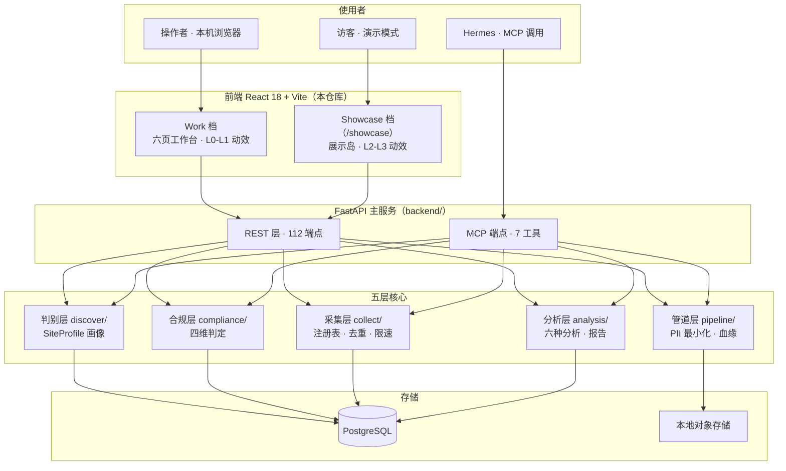

# WebInsight 平台 · v5 升级蓝图

> 从「能用」到「值得展示」：提示词升级 × 究极版前端 × MVP 计划
> 侦察日期：2026-09-14 · 侦察范围：本仓库 + `D:\网站复刻实战项目` + `D:\UI设计库网站集合`
> 文档链：REBUILD-SPEC-v3（规格）→ HERMES-PROMPT-v3（提示词）→ UPGRADE-PLAN-v4（规划）→ **本文 v5（展示升级）**
> 定位：本文是设计方案，不是施工单；确定做哪几项后拆成可执行任务。

---

## 0. 三源侦察结论

### 0.1 本仓库（D:\智能数据分析平台）

**已建成（v3.0）**，五层后端 + 前端六页 + MCP 工具层：

| 层 | 位置 | 能力 |
|---|---|---|
| 判别层 | `backend/discover/` | SiteProfile 站点画像 |
| 合规层 | `backend/compliance/` | 四维合规判定 |
| 采集层 | `backend/collect/` | 能力注册表、三级去重、自适应限速、任务调度 |
| 管道层 | `backend/pipeline/` | 规范化、PII 最小化、数据集物化、字段级血缘 |
| 分析层 | `backend/analysis/facade.py` | 六种分析、报告生成、三格式导出 |
| 工具层 | `backend/mcp/` | 7 个 MCP 工具、Bearer 鉴权、审计留痕 |
| 界面层 | `frontend/src/` | 六页：Analytics / Collect / Dashboard / Datasets / Discover / Reports |

- 规模：112 个 REST 端点 + 1 个 MCP 端点、105 个自动化测试（来源：`UPGRADE-PLAN-v4.md` §1.1）
- 前端栈（来源：`frontend/package.json` 实测）：React 18 + Vite 5 + Tailwind 3 + Radix/shadcn 系 + TanStack Query 5 + Zustand + ECharts 5 + **motion 12**（framer-motion 新包名，已在依赖中）+ sonner + vaul
- 设计系统（来源：`frontend/src/index.css` 实测）：深色近黑蓝底 `222 26% 7%` + 青蓝主色 `186 92% 50%` + 琥珀强调 `38 92% 58%`；基础件：玻璃拟态 `.glass`、网格 `.grid-bg`、极光 `.aurora`、`.mono-tag`、`.badge-dot`、tabular-nums、滚动条美化
- 视觉储备（来源：`REBUILD-PROGRESS.md`）：全屏 Canvas 粒子背景（72 粒 / DPR 上限 2 / 页面隐藏暂停 / reduced-motion 静态化）、六种骨架屏、响应式抽屉

**v4 已规划未执行**（来源：`UPGRADE-PLAN-v4.md`）：P7 自动化闭环 / P8 治理可观测 / P9 数据资产 / P10 生产化；六页 → 十五页信息架构。

### 0.2 复刻项目（D:\网站复刻实战项目）——「设计弹药库」

**已收官实证**（来源：`README.md`、`knowledge/learn/threejs/README.md`）：

- samsy.ninja：跨侧像素 99.9% 一致，WebGPU/TSL 管线
- exoape.com：6/6 路由 similarity 100%，GSAP 滚动叙事编排
- lusion.co：22 路由、99.38% 源码化、31/31 对拍全绿；手持 **33822 行带行号坐标系源码**

**three.js 内化学习（GOAL-034）—— 直接可迁移的技法成果**：

| 状态 | 专题 | 内容 |
|---|---|---|
| ✅ | T01 工程骨架 | Engine 主循环 + taskManager 泵 |
| ✅ | T05 GPGPU 粒子 | 16384 粒子双 RT ping-pong 模拟（demo 已验证，切向/径向比 34374） |
| ✅ | T08 后处理链 | bloom / HALO / FSR / SMAA（HALO 鬼影对映点验证） |
| ⏳ | 其余 9 专题 | 滚动系统、滚动叙事、相机编排、蓝噪声、curl noise 等 |
| 🎓 | 毕业作品 | GPGPU 粒子 + 后处理链 + 滚动叙事三技法组合（原创美术方向） |

**方法论资产**（比代码更保值）：

- 证据纪律：「形状完整 ≠ 在跑」——先查调用点再谈机制（ERR-20260911-05，hubtown M4r）
- 量化对拍协议：boot-phase-aligned，跨侧残差 ~14 → ~2.0-2.2（lusion batch9）
- 门禁文化：每个 demo 自带 verify.mjs + 截图证据（threejs 学习地图）

### 0.3 UI 资源（D:\UI设计库网站集合\具体网址.txt）——「美学弹药库」

| 源 | 性质（已验证） | 用法 |
|---|---|---|
| designprompts.dev | 31+ 设计风格画廊，同一份数据渲染不同风格，产出 AI-ready 提示词（来源：站点自述） | 设计探索期：生成风格变体提示词 |
| 21st.dev | 139 个组件库的聚合目录、shadcn registry 生态（来源：21st.dev/community/libraries） | 组件货源：挑中即复制源码 |
| ui.aceternity.com | 262 组件、Framer Motion 动效（aurora / 3D cards / bento / scroll reveal / timelines），"drop into any Next.js or React project"（来源：21st.dev Aceternity 页） | 动效设计参考 + 节选组件改造 |
| uiprompt.site / uiprompt.art | UI 提示词库 | 设计协作参考 |
| bentogrids.com | Bento 网格布局参考 | 统计区 / 能力矩阵布局 |

### 0.4 综合判断：缺的不是功能，是三件事

1. **展示层**——前端动效目前是"能用"级（L0），缺 L1-L3 的体系化分级与"业务含义动效"。
2. **演示资产**——无演示脚本、无 GIF/截图资产、README 未按展示标准整备（简历/GitHub 场景）。
3. **展示质量协议**——动效无性能预算、无降级链、无验收纪律；"炫"和"稳"没有边界条款。

---

## 1. 提示词 v5 升级

### 1.1 版本诊断

| 版本 | 定位 | 已有 |
|---|---|---|
| 用户手持版（≈v2 系） | 通用设计 | 角色 / 四维合规 / 七个能力模块 / 技术栈 / 开发阶段 0-5 / 验收 10 条 |
| v3（`HERMES-PROMPT-v3.md`） | 项目特定 | + 双部署形态 Full/Lite、核心抽象、工程约束、项目现状诊断 |
| **v5（本文）** | 展示升级 | + 展示层协议、美学宪法、知识回流通道 |

v5 不推翻 v2/v3，是**增量叠加**：项目状态已从"建成"进入"值得展示"，提示词补上展示维度的纪律。

### 1.2 v5 新增三个协议（可直接并入提示词）

#### 协议一 · 双档渲染（Work / Showcase）

```markdown
## 前端渲染双档位
同一前端代码，两个渲染档位：
- Work 档（默认）：数据优先。动效上限 L1，零 3D。面向日常使用与生产。
- Showcase 档（/showcase 路由或 ?mode=showcase）：叙事优先。允许 L2-L3 动效。
  面向演示、GitHub 展示、面试。
切换只改变表现层，不改变功能与数据链路。数据获取逻辑绝不因档位分叉。
```

#### 协议二 · 美学宪法（动效分级与预算）

```markdown
## 美学的工程约束
1. 每个动效必须有业务含义（解释数据 / 指示状态 / 引导注意力），禁止纯装饰新动效。
2. 动效分级 L0-L3，每级有预算与降级链（见 UPGRADE-PLAN-v5 §2.2）。
3. 硬预算：首屏 JS ≤ 300KB gzip；L3 场景仅 lazy chunk（≤350KB）；
   全部动效 60fps（低端机可降 30fps，不允许掉帧到不可用）。
4. prefers-reduced-motion 全静态化；three.js 仅在 L3 且设备能力达标时加载。
5. 动效验收纪律（继承复刻项目）：必须证明动效在真实路径被触发
   （「形状完整 ≠ 在跑」）；Playwright 截图 + performance 采样为证据。
```

#### 协议三 · 知识回流通道（复刻 → 平台）

```markdown
## 学习资产回流通道
复刻项目的技法学习按「最小 demo → 平台集成」两级回流：
- 已完成可用：T05 GPGPU 粒子、T08 后处理链、T01 工程骨架
- 回流标准：demo 通过验证 + 以隔离岛形式接入 + 性能预算内 + 有降级路径
- 禁止：不从复刻项目直接拷贝源站资产（素材版权归原站作者）；只迁移技法与自研代码
```

### 1.3 验收标准增补（原 10 条 → 13 条）

11. 性能预算达标：首屏 JS ≤ 300KB gzip、L3 场景懒加载且能力门控、reduced-motion 全静态化。
12. 演示交付物齐备：演示脚本可复现、README 含演示 GIF 与架构图、一键演示脚本可用。
13. 动效证据化：每个 L2/L3 动效有触发证据（截图/采样），不允许"写了但没跑"。

---

## 2. 究极版前端设计（核心章）

### 2.1 设计命题

> **「让数据自己讲故事」——一个看起来像电影、用起来像工具的合规数据平台。**

三条戒律：

1. **业务含义优先**：每个动效解释数据、指示状态或引导注意力，不做纯装饰。粒子是"数据流"，扫描线是"质检中"，光晕是"可采状态"。
2. **隔离炫技**：所有 L3 重动效封在"展示岛"（登录页 / /showcase），工作区永远冷静（数据可读性第一）。这精确化了 v4 §6.2 的"不引入 three.js"——在**工作区**不引入，在**展示岛**有边界地引入（懒加载 + 能力门控 + 降级链）。
3. **预算硬约束**：炫不能以卡为代价。任何新增依赖进门前先过预算表（§2.6）。

### 2.2 动效四层分级（L0–L3）

| 级别 | 覆盖 | 内容 | 预算 | 依赖 | 降级 |
|---|---|---|---|---|---|
| **L0 基线** | 全站 | 页面转场（fade+slide 200ms）、交互反馈 150ms、骨架屏、数字滚动 | ~0 | motion（已有） | reduced-motion 静态 |
| **L1 组件** | 全站按需 | 卡片 hover 微倾斜、列表 stagger 入场、图表统一入场编排（ECharts）、扫描线/活性光效 | 30–60KB 内 | 零新依赖 | 视口外不触发 |
| **L2 页面** | 关键页 | 工作台 Hero 滚动叙事、采集管道流动画、合规四维矩阵可视化、任务时间线 | ≤100KB/页 | 零/轻依赖 | 低端设备降为静态图表 |
| **L3 展示岛** | 登录/欢迎页、/showcase | 数据星云（three.js GPGPU 降规模版）、3D 场景叙事 | ≤350KB lazy | three（懒加载） | 能力不达标 → Canvas 2D 版视觉 |

**L1 实现要点**（全部零新依赖，用已有 motion + CSS）：

- 滚动揭示：`IntersectionObserver` + motion `whileInView`，stagger 50ms（思想源自 hubtown M4r 的 position-driven 调度：揭示由位置驱动，不进渲染循环）
- 卡片微倾斜：CSS `transform: perspective() rotateX/Y`，跟随鼠标 ±3°，200ms 归位
- 图表编排：ECharts 统一 `animationDuration: 800, animationEasing: 'cubicOut'`，多系列 stagger 50ms
- 活性光效：`.animate-scan`（已有）用在"进行中"状态；`.animate-pulse-soft` 用在"等待确认"

**L2 四个页级动效的设计**：

1. **工作台 Hero 滚动叙事**：顶部统计数字（画像数 / 采集条目 / 数据集）随滚动从 0 滚到目标值，背景网格视差 0.2s 缓动。参考 exoape 的滚动叙事编排（用 motion + 原生滚动实现，**不引入 GSAP 全量**）。
2. **采集管道流动画**（任务详情/工作台）：`URL → 判别 → 采集 → 清洗 → 入库 → 分析` 六节点 SVG 管道；粒子沿 path 流动（`stroke-dashoffset` + Canvas overlay），节点状态映射真实任务进度（脉冲=进行中，绿=完成，琥珀=等待人工）。**状态必须来自真实数据，不允许假动画**。
3. **合规四维矩阵可视化**（合规中心）：4(A) × 5(B) 点阵空间，每个判定是一条记录，打点着色（绿=可执行 / 黄=待确认 / 红=阻断）；点击点展开四维取证 + 替代源 + 覆盖率。这是"合规必须落成代码"的展示化外显面。
4. **任务时间线**：创建 → 开始 → 分片 → 完成 的事件流，节点逐个点亮（stagger）+ 耗时标注。position-driven（同 L1 纪律）。

### 2.3 三个「Wow 时刻」（演示脚本 = 面试口播稿）

**S1 · 开场（登录 / 欢迎页，0–10 秒）**

- 全屏数据星云：粒子沿流线汇聚散开，青蓝→琥珀色相渐变（T05 技法降规模版：~4000 粒子）
- 中央标题浮现：**"WebInsight —— 任意站点，从可采判定到洞察报告"**
- 副标（事实性背书）：`112 REST 端点 · 四维合规矩阵 · MCP 原生 · 105 测试全绿`
- 进入按钮 → 工作台

**S2 · 旗舰演示（30–90 秒，真实后端全链跑）**

1. 输入任意 URL → 点「分析」
2. 四维判定逐维点亮动画（A 可访问性 → B 授权基础 → C 行为合规 → D 数据属性，每维证据标签飞入）
3. 判定结果卡 → 一键「创建采集」
4. 采集管道流动画实时映射任务（节点脉冲）
5. 物化为数据集 → 一键分析 → 图表入场编排 → 报告生成
6. 兜底：预录 GIF（后端未启动时演示模式可播）

**S3 · 深度彩蛋（合规中心）**

- 四维矩阵总览（点阵三色）
- 点任一红点（阻断判定）→ 展开四维取证理由 + 替代数据源清单 + 预估覆盖率
- 一句话收尾："它不装作无所不能——它证明自己每一步都合规。"

### 2.4 复刻 → 平台：技术转化清单

| 技法 / 资产 | 来源 | 转化目标 | 用在 | 预算 |
|---|---|---|---|---|
| GPGPU 粒子（降规模至 ~4000） | threejs T05 | 数据星云（登录页 / showcase） | L3 | ~250KB lazy |
| 后处理链（取 bloom 单 pass） | threejs T08 | 星云光晕（不全上 HALO/FSR） | L3 | 内含 |
| Engine 主循环骨架 | threejs T01 | 场景引擎封装（pause/resume/dispose 生命周期） | L3 | 内含 |
| 滚动揭示调度（position-driven） | hubtown M4r | IntersectionObserver 揭示系统 | L1/L2 | 0 |
| 滚动叙事编排 | exoape | 工作台 Hero 数字滚动 + 视差 | L2 | 0（motion） |
| 相机编排（spline） | threejs T12 | /showcase 场景相机路径（二期） | L3+ | 内含 |
| **boot-phase-aligned 对拍协议** | lusion batch9 | **前端视觉回归**：Playwright 截图对拍（关键页基准图 + 容差） | 质检 | 0 |
| **「形状完整 ≠ 在跑」证据纪律** | hubtown M4r | 动效验收：每个动效必须有触发截图/采样 | 质检 | 0 |

> 禁项：不从复刻项目拷贝任何源站资产（素材版权归原站作者）；只迁移技法与自研 demo 代码。

### 2.5 UI 库接入策略

**纪律：复制源码，不加运行时依赖**（shadcn 模式；21st.dev / Aceternity 均为此模式）。

| 源 | 挑什么 | 怎么用 |
|---|---|---|
| 21st.dev | 命令面板增强、通知、数据卡片、时间线、对比块 | 挑中 → 复制源码 → 改造为平台设计 token（青蓝/琥珀） |
| Aceternity UI | aurora 背景、spotlight、3D card、bento grid、scroll reveal 五类 | **优先作设计参考**；用 CSS/transform 重写为平台版；仅个别复杂件引源码 |
| designprompts.dev | 风格变体提示词 | 设计探索期：同一页面生成 3 种风格候选，选型后再开发 |
| uiprompt.site / .art | 中文圈组件提示词 | 同上 |
| bentogrids.com | Bento 布局 | 工作台统计区、/showcase 能力矩阵 |

**接入前置检查**（每个候选组件）：① 是否依赖 `next/*`（是则改写）；② 是否引入新 npm 依赖（进预算表评估）；③ 是否支持 reduced-motion；④ 深色主题适配（平台默认深色）。

### 2.6 性能预算与降级链

| 指标 | 预算 | 现状/说明 |
|---|---|---|
| 首屏 JS（gzip） | ≤ 300KB | v4 口径首屏 587KB；先做依赖精简（清 antd/重复图表库）再引入新动效 |
| L2 页 chunk | ≤ 100KB/页 | 路由级 code split（React.lazy + dynamic import） |
| L3 场景 chunk | ≤ 350KB（lazy） | three core + 场景 + bloom；**两级懒加载**（路由懒 → 场景再懒） |
| 首屏 LCP | < 2.5s（本地演示 < 1s） | 演示机以本地为准 |
| 动效帧率 | L0-L2 60fps；低端 30fps 可降 | 用 rAF 采样 + performance 面板验收 |
| reduced-motion | 全静态化 | `prefers-reduced-motion: reduce` 时跳过所有非必要动效 |

**L3 加载门槛（设备能力检测）**：

```
进入展示岛：
  if (prefers-reduced-motion) → 静态渐变版
  else if (WebGL 不可用 || hardwareConcurrency < 4 || deviceMemory < 4) → Canvas 2D 星云版
  else → 动态 import three 场景（含降级 try/catch → Canvas 2D 版）
```

**降级链全景**：three.js 场景 → Canvas 2D 星云 → 静态渐变 + 极光（纯 CSS）→ 无障碍静态版。每一级都好看，只是复杂度递减。

---

## 3. 架构总览与四维合规判定

### 3.1 总架构（v3.0 现状 + v5 展示层）



### 3.2 四维合规判定（已实现，强化为展示资产）

**矩阵（保持 v2/v3 原设计不变）**：

- A 可访问性：A1 完全公开 / A2 公开需凭证 / A3 部分公开 / A4 技术隔离
- B 授权基础：B1 官方开放 / B2 用户自有凭证 / B3 用户书面授权 / B4 未声明（→授权确认流程） / B5 来源不明（→不可采）
- C 行为合规：C1 robots 路径级遵守 / C2 频率自适应 / C3 标识身份 / C4 尊重 429/503 / C5 缓存增量
- D 数据属性：D1 公开信息 / D2 受版权保护 / D3 个人数据（最小化） / D4 法定禁止（→不可采）

**组合规则**（不变）：A1-A3 + B1/B2/B3 + C1-C5 + D1 直接执行；B4 走授权确认流程（不暂停）；A4/B5/D4 不可采分支（必须附替代源 + 覆盖率）。

**v5 强化点（展示向）**：

1. 四维矩阵可视化（§2.2 L2-3）——判定从数据库记录变成"看得见、可复核、能交接"的界面资产。
2. 授权确认清单模板化——`PATCH /verdicts/{id}` 写回授权声明（v4 §4.5 已有规划）。
3. 替代源库沉淀（v4 C3）——不可采分支输出的替代路径在展示时直接可见。

### 3.3 MCP 工具层（7 工具，不变）

`analyze_site` / `plan_collection` / `run_collection` / `job_status` / `query_dataset` / `run_analysis` / `make_report`
（权限：Bearer 鉴权 + 审计留痕；不放宽。）

---

## 4. MVP 开发计划（P7–P12）

### 4.1 排序原则：展示价值 × 工程价值

v4 的 P7-P10 保持骨架；v5 在 P8 与 P9 之间插入**展示工程两期（P11 前半 / P12）**。顺序理由：

- P7/P8 是"能讲的故事"的支撑（自动化 = 系统感；治理 = 合规差异化）
- 展示层要在 P8 之后做——因为合规中心（最强展示素材）是 P8 的产出
- 展示资产（GIF/README/演示脚本）放在最后统一收割

### 4.2 各期详情

| 期 | 内容 | 工作量（参考） | 验收 |
|---|---|---|---|
| **P7 · 自动化闭环** | E2 定时调度 + `/schedules`、E3 断点续传重入、`/sites` 站点库、`/collect/:jobId` 任务详情 | ~10d | 登记站点→每小时调度→连跑 3 次→增量命中；任务详情见完整降级链 |
| **P8 · 治理与可观测** | D1 测试库隔离+清脏表、C1 合规中心+`/compliance`、C2 审计检索+`/audit`、O1 运行监视+`/monitor`、O6 AGENTS.md 重写 | ~9d | 任一数据可沿「数据→血缘→规则→画像→判定→审计」一路回溯 |
| **P11a · 动效体系一期** | F1：L0/L1 基础设施（转场/揭示/图表编排/reduced-motion 守护）；F2：工作台 Hero 叙事；F3：采集管道可视化；F4：合规四维矩阵可视化 | ~5d | 三个验收：① 关键页动效有触发证据；② 首屏 JS 预算达标；③ reduced-motion 全静态 |
| **P12 · 展示岛二期** | F5：登录/欢迎页数据星云（Canvas2D 先行，three.js 版评估后上）；F6：`/showcase` 演示路由（滚动叙事长页）；F7：演示资产（GIF/截图/README 门面/一键演示脚本） | ~5d | 演示脚本 90 秒全链跑通；README 首屏含 GIF + 架构图 + 测试徽章 |
| **P9 · 数据资产深化** | D2 版本快照、D3 保留策略、D4 检索层、`/datasets/:id`、A1 对比分析+`/compare` | ~10d | 两次采集可对比差异；大数据集可字段检索 |
| **P10 · 生产化** | O2 MCP 部署脚本、O3 两形态协作、O4 Prometheus、O5 备份、`/integrations` | ~11d | Hermes 走 MCP 完成「分析→采集→分析→报告」闭环且可审计 |

> 工作量引自 v4 估算（AI 辅助净开发日），新增项为 v5 估算；以实际为准。

### 4.3 如果只做三件事（v5 版）

1. **D1 测试库隔离 + 清脏表**（1d）—— 现在就能做，越拖越脏（v4 结论不变）
2. **F1 前端动效基础设施**（~2d）—— L0/L1 + reduced-motion 守护是全部展示的上限工程；先立规则再动手
3. **E2 定时调度 + `/sites`**（~6d）—— 决定平台"是工具还是系统"，也是演示脚本 S2 的支点

### 4.4 阶段映射（对照提示词原始阶段 0-5）

| 原阶段 | 状态 | 对应 |
|---|---|---|
| 0 需求/框架/架构 | ✅ 已过 | REBUILD-SPEC-v3 |
| 1 URL 分析/判定/采集/存储 | ✅ 已建成 | discover/ + compliance/ + collect/ |
| 2 智能解析/调度/增量/去重 | ⏳ 大半建成 | 调度在 P7、断点续传 E3 |
| 3 清洗/分析/可视化/报告 | ✅ 已建成 | pipeline/ + analysis/ |
| 4 Agent 工作流/API/权限/审计 | ⏳ 部分 | MCP 已建；审计检索在 P8；监控 O1 |
| **4.5 展示工程（v5 新增）** | ⏳ | **P11a + P12** |
| 5 多租户/插件/生产部署 | ⏳ 后置 | P10 |

---

## 5. 验收与风险

### 5.1 展示级验收标准（新增 9 条）

1. 打开任意关键页，`prefers-reduced-motion` 下无任何非必要动效。
2. 首屏 JS（gzip）≤ 300KB；`/showcase` 的 three.js chunk 不在首屏请求序列中。
3. 每个 L2/L3 动效有触发证据（截图或 performance 采样存档于 `docs/evidence/`）。
4. 演示脚本 S1→S3 可复现（`scripts/demo.ps1` 一键起全栈 + 打开 showcase）。
5. README 首屏含：演示 GIF（≤5MB）、架构图、测试徽章、"90 秒演示"入口。
6. 合规中心能用可视化矩阵解释任一条判定（含证据与替代源）。
7. 采集管道动画的节点状态来自真实任务数据（禁止假动画）。
8. 移动端（375px 宽）关键页不横向溢出、动效降级正常。
9. 全部新增依赖通过预算表准入（无未经评估的依赖进入主包）。

### 5.2 风险表

| 风险 | 影响 | 缓解 |
|---|---|---|
| 动效改造撞上包体预算 | 首屏变慢 | F1 前先执行依赖精简（清 antd/重复图表库，v4 遗留项） |
| three.js 与学习计划耦合 | 进度互相牵扯 | L3 一期只用现成 T05/T08 成果，二期再接滚动/相机专题 |
| 动效"写了没跑"（复刻教训) | 演示翻车 | 强制触发证据（验收第 3 条） |
| 展示岛与工作区样式分叉 | 维护双轨 | 共用设计 token；仅动效档位分叉，样式体系同源 |
| 21st/Aceternity 组件带 Next 依赖 | 集成失败 | 接入前置检查四问（§2.5） |
| 合规可视化过度美化模糊边界 | 传达失真 | 红/黄/绿仅表达判定状态，不加修饰性色；证据链可展开 |

### 5.3 不确定项（诚实标注）

- 用户手持提示词的确切版本号为**推断**（依据：缺双部署形态段，晚于 v3 之前；无 v2 原文对照）。
- "首屏 587KB / 总包 5.35MB" 为 v4/REBUILD-PROGRESS 的口径，**未经本次实测**；动效改造前需跑一次 `vite build` 复查。
- `themeStore`（data-theme 属性 vs Tailwind dark: class）修复状态**未在本次验证**；动效改造前需实测暗色链路。
- 21st.dev / Aceternity 具体组件的 Next.js 依赖情况需**逐组件验证**（个别组件依赖 `next/image` 等）。
- lusion threejs 学习专题 05/08 的 demo 为学习产物，**在平台中的性能表现需实测**（16284 粒子降至 ~4000 后另测）。

---

## 附录 A · 与 v4 §6.2 的关系（为什么这是升级不是摇摆）

v4 说"不建议引入 three.js（+600KB、低端掉帧，收益只是更炫）"——**这个判断在工作区继续生效**。
v5 的处理是把"不做"精确化为三条边界：

1. **场所边界**：three.js 只进展示岛（登录页 / /showcase），不进六页工作区。
2. **加载边界**：路由懒 → 场景再懒，首屏与工作区零成本；能力门控不达标则降级。
3. **收益边界**：展示岛的收益不是"更炫"，是**演示叙事**（简历/GitHub/面试场景的沟通效率）。

## 附录 B · 证据索引（本次侦察引用源）

| # | 来源 | 关键内容 |
|---|---|---|
| 1 | `docs/UPGRADE-PLAN-v4.md` | v3.0 现状、四问题、P7-P10、页面设计、§6.2 3D 边界 |
| 2 | `docs/REBUILD-SPEC-v3.md` | 五层架构、成功判据、红线 |
| 3 | `docs/HERMES-PROMPT-v3.md` | 双部署形态、工程约束 |
| 4 | `docs/REBUILD-PROGRESS.md` | P6 前端：设计系统/粒子/骨架/响应式；包体口径 |
| 5 | `frontend/package.json` / `src/index.css` | 依赖清单、设计 token |
| 6 | `D:\网站复刻实战项目\README.md` | samsy/exoape 交付、方法论 |
| 7 | `..\_triage-3d\VERDICTS.md` | 8 站判级、lusion 旗舰 |
| 8 | `..\lusion-rebuild\sessions\batch9-completion-report.md` | boot-phase 对拍协议 |
| 9 | `..\hubtown-rebuild\sessions\m4r-scroll-reveal-scheduler.md` | 揭示调度 + 证据纪律 |
| 10 | `..\knowledge\learn\threejs\README.md` | T01/T05/T08 成果、十二专题地图 |
| 11 | `D:\UI设计库网站集合\具体网址.txt` | 六个 UI 参考源 |
| 12 | designprompts.dev / 21st.dev / ui.aceternity.com | UI 库性质验证（web 检索 2026-09-14） |
